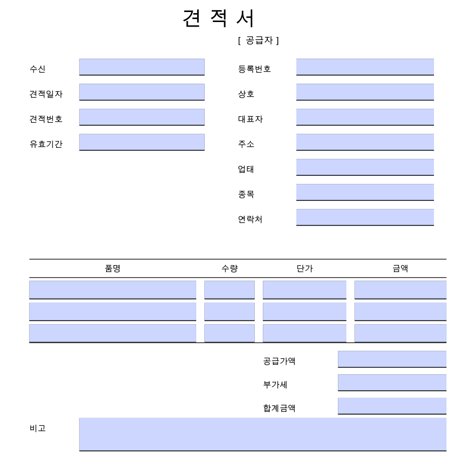
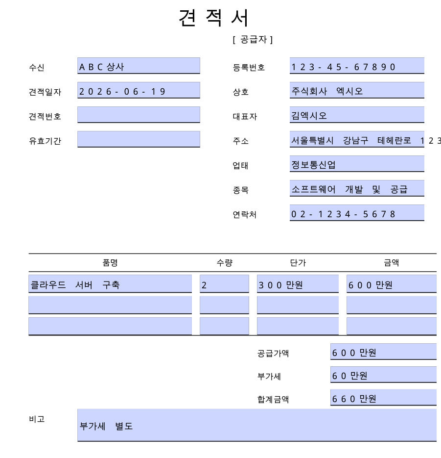
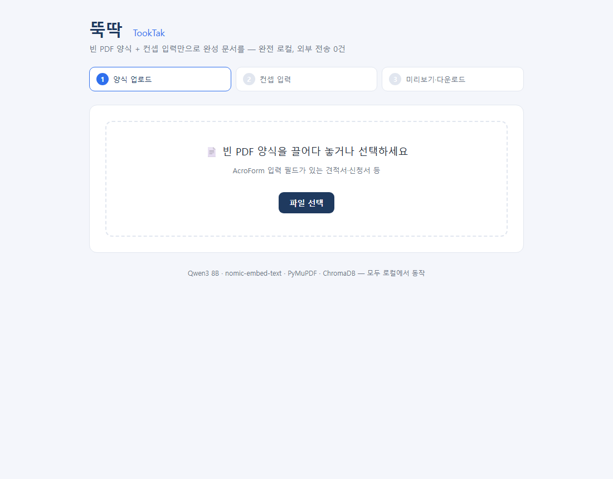
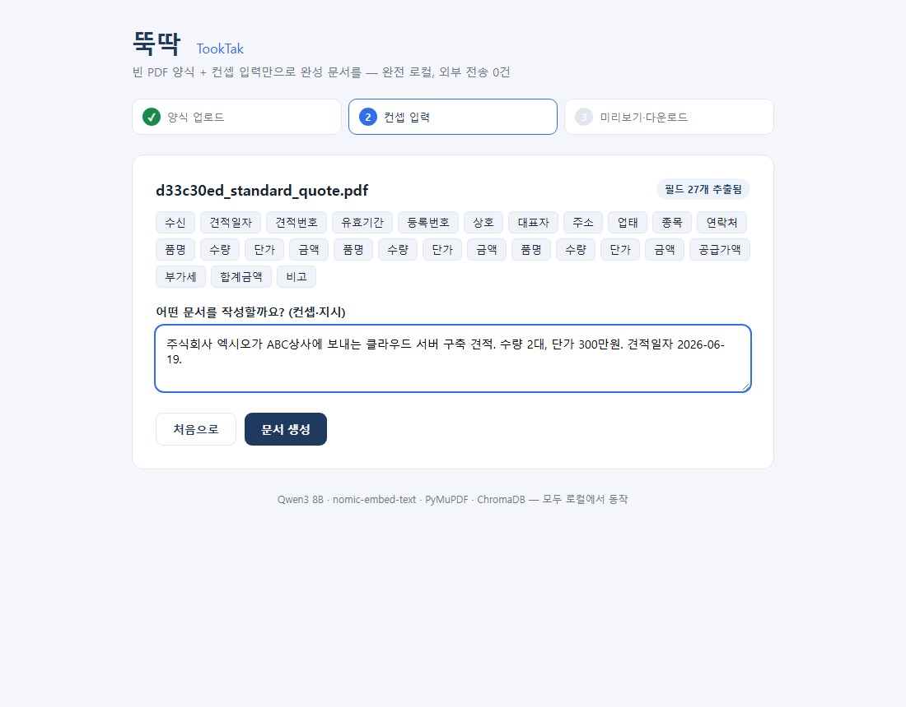
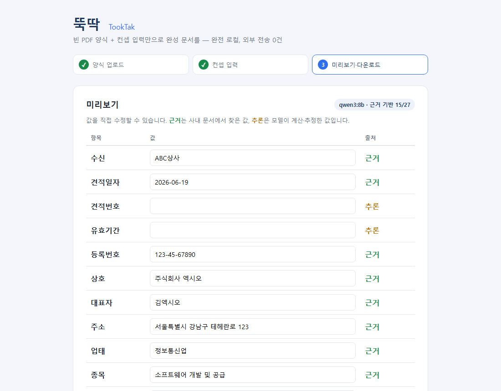

# 뚝딱 (TookTak)

[](https://github.com/car216999/PDF_auto_maker)
[](https://www.python.org/)
[](https://fastapi.tiangolo.com/)
[](https://react.dev/)
[](https://ollama.com/)
[](https://www.trychroma.com/)
[](backend/tests)
[](#)

> 저장소: **https://github.com/car216999/PDF_auto_maker**

오픈소스 LLM·RAG 기반 **PDF 양식 자동 작성 시스템**. 빈 양식 + 컨셉 입력만으로 완성 문서를 생성한다.
**외부 API 호출 0건 — 완전 로컬.** (Qwen3 8B · nomic-embed-text · PyMuPDF · ChromaDB)

## 처리 흐름

```
빈 양식 업로드 → PDF 파싱 → RAG 검색 → LLM 생성 → 좌표 주입 → 미리보기/다운로드
              (parsing)   (rag)    (generation)  (injection)
```

## 시연

빈 견적서 양식에 **컨셉 한 줄**만 입력하면, 사내 문서를 근거로 27개 필드를 채워 완성 PDF를 만든다.

| 입력 — 빈 견적서 양식 | 출력 — 시스템이 채운 완성 문서 |
|:---:|:---:|
|  |  |

> 입력 컨셉: *"주식회사 엑시오가 ABC상사에 보내는 클라우드 서버 구축 견적. 수량 2대, 단가 300만원."*
>
> 공급자 정보(등록번호·상호·대표자·주소·업태·종목·연락처)는 **사내 문서에서 조회**, 공급가액·부가세·합계금액은 **자동 계산**, 사용하지 않는 품목 행은 **그대로 비움** — 모두 한글 폰트로 좌표에 정밀 주입.
>
> *(스크린샷은 `backend/scripts/make_screenshots.py` 로 재생성 가능)*

### 웹 UI — 업로드 → 컨셉 입력 → 미리보기

| 1. 양식 업로드 | 2. 컨셉 입력 | 3. 미리보기·다운로드 |
|:---:|:---:|:---:|
|  |  |  |

> 미리보기에서 각 값은 **`근거`**(사내 문서에서 찾음) / **`추론`**(모델이 계산·추정)으로 구분 표시되어, 사용자가 신뢰도를 한눈에 보고 수정할 수 있다 — 환각 검수가 UI에 녹아든 부분.

## 빠른 시작 — Docker (권장)

```bash
docker compose up --build
# 프론트엔드: http://localhost:5173
# 백엔드 API 문서: http://localhost:8000/docs
```

`ollama → 모델 다운로드 → 백엔드 → 프론트엔드` 순으로 자동 기동한다.
최초 1회 모델 다운로드(~5GB)가 있고, 이후에는 외부 통신이 없다.
GPU 사용 시 `docker-compose.yml` 의 `deploy.resources` 주석을 해제한다.

## 빠른 시작 — 로컬 개발

```bash
# 0) Ollama + 모델 (최초 1회)
ollama pull qwen3:8b
ollama pull nomic-embed-text

# 1) 백엔드
cd backend
uv sync
uv run python -m scripts.index_knowledge        # 사내 문서 인덱싱
uv run uvicorn app.main:app --port 8000

# 2) 프론트엔드 (다른 터미널)
cd frontend
npm install
npm run dev                                       # http://localhost:5173
```

## 구조

```
tooktak/
├─ backend/          FastAPI — 파싱·RAG·생성·주입·평가
│  ├─ app/
│  │  ├─ schemas/    모듈 간 인터페이스 계약
│  │  ├─ parsing/    PyMuPDF 폼필드·좌표 추출
│  │  ├─ rag/        청킹·임베딩·ChromaDB 검색
│  │  ├─ generation/ Ollama(qwen3) 필드값 생성
│  │  ├─ injection/  좌표 한글 주입·평탄화
│  │  └─ eval/       KPI 측정 하네스
│  ├─ scripts/       양식 생성·인덱싱·평가 실행
│  └─ tests/         37개 (오프라인 빠른 검증)
├─ frontend/         React + Vite 대시보드
├─ data/             knowledge(지식) · forms(양식) · chroma(인덱스)
└─ docker-compose.yml
```

## KPI (기획서 11장 — 실측)

```bash
cd backend && uv run python -m scripts.run_eval
```

| KPI | 측정값 | 합격선 |
|---|---|---|
| 폼필드 채움 정확도 | 93% | ≥ 80% |
| 문서 작성 시간 단축 | 99% | ≥ 50% |
| 근거 일치율 | 100% | ≥ 90% |
| 외부 호출 0건 (소켓 실측) | 0건 | == 0 |

## 팀

뚝딱(TookTak) — 김세경(총괄·프론트) · 채요한(파싱) · 박은선(RAG) · 이권형(생성·백엔드)
