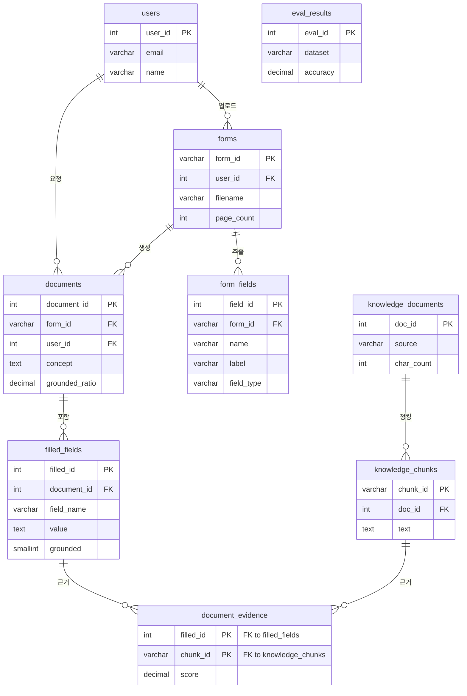

# 데이터베이스 요구사항 분석서

과제명: 오픈소스 LLM·RAG 기반 PDF 양식 자동 작성 시스템 (뚝딱, TookTak)
2026. 06. 22.

---

## 1. 요구사항 정의서

| 문서버전 | v1.0 | 작성일시 | 2026.06.22 | 작 성 자 | 뚝딱팀 |
|---|---|---|---|---|---|

① 사용자로 가입하려면 이메일, 이름을 입력해야 하며, 사용자는 사용자 ID로 식별한다.
② PDF 양식(파일)은 양식 ID로 식별하며, 파일명·페이지수·AcroForm 여부·저장경로·업로드일시 정보를 포함한다.
③ 하나의 양식은 여러 폼필드를 가지며, 폼필드는 필드 ID로 식별하고 필드명·라벨·타입·좌표·필수여부·최대길이 정보를 포함한다.
④ 사용자는 여러 양식을 업로드할 수 있고, 하나의 양식은 한 사용자에게 속한다.
⑤ 지식 문서는 문서 ID로 식별하며, 출처·제목·글자수·인덱싱일시 정보를 포함한다.
⑥ 하나의 지식 문서는 여러 청크로 분할되며, 청크는 청크 ID로 식별하고 본문·순번·글자수 정보를 포함한다. (임베딩 벡터는 Qdrant에 별도 저장)
⑦ 생성 문서(작업)는 문서 ID로 식별하며, 대상 양식·요청자·컨셉·사용 모델·근거율·상태·출력경로·생성일시 정보를 포함한다.
⑧ 하나의 생성 문서는 여러 채운 필드를 가지며, 채운 필드는 필드명·값·근거여부·신뢰도 정보를 포함한다.
⑨ 채운 필드는 여러 지식 청크를 근거로 가질 수 있고, 하나의 청크는 여러 채운 필드의 근거가 될 수 있다(다대다). 근거 연결은 유사도 점수를 포함한다.
⑩ KPI 평가 결과는 평가 ID로 식별하며, 데이터셋·정확도·시간단축·근거율·외부호출수·측정일시 정보를 포함한다.

---

## 2. 객체 정의서

| 객체 명 | 속성 명 |
|---|---|
| 사용자 | ID, 이메일, 이름, 가입일시 |
| PDF 파일 | 양식 ID, 사용자 ID, 파일명, 페이지수, AcroForm 여부, 저장경로, 업로드일시 |
| 폼 필드 | 필드 ID, 양식 ID, 필드명, 라벨, 타입, 페이지, 좌표(x0·y0·x1·y1), 필수여부, 최대길이 |
| 지식 문서 | 문서 ID, 출처, 제목, 글자수, 인덱싱일시 |
| 지식 청크 | 청크 ID, 문서 ID, 순번, 본문, 글자수 |
| 생성 문서 | 문서 ID, 양식 ID, 사용자 ID, 컨셉, 모델, 근거율, 상태, 출력경로, 생성일시 |
| 채운 필드 | 채운값 ID, 문서 ID, 필드명, 값, 근거여부, 신뢰도 |
| 근거 연결 | 채운값 ID, 청크 ID, 유사도 점수 |
| 평가 결과 | 평가 ID, 데이터셋, 정확도, 시간단축, 근거율, 외부호출수, 측정일시 |

---

## 3. E-R Diagram

> 컬럼별 타입·제약 상세는 [테이블 명세서](테이블명세서.md), DDL은 [erd.txt](erd.txt) 참조.
