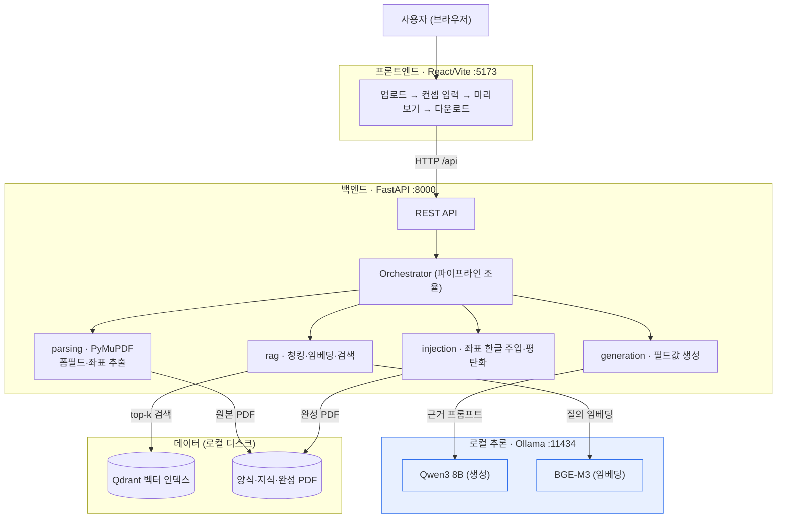
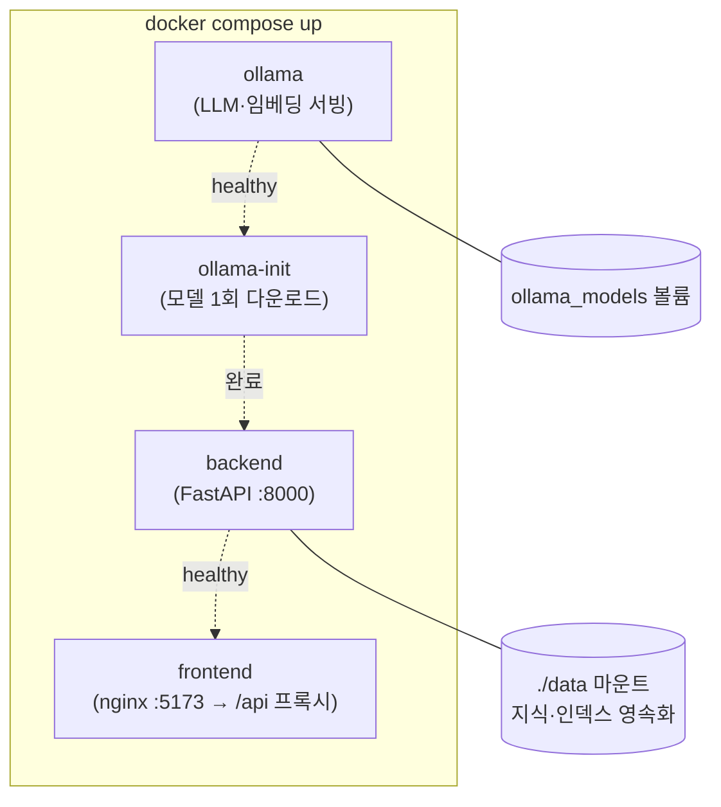

# 뚝딱(TookTak) 시스템 구성도

> 모든 구성요소가 **사내(로컬)에서 동작** — 외부 네트워크 호출 0건. (Mermaid 다이어그램, GitHub에서 자동 렌더링)
>
> **PPT·문서용 PNG**: [① 아키텍처](diagrams/01_architecture.png) · [② 처리 흐름](diagrams/02_pipeline.png) · [③ 배포](diagrams/03_deployment.png)
> (소스: `diagrams/*.mmd` — `mermaid-cli`로 재생성)

---

## 1. 계층형 아키텍처

> 외부 API 미사용 · 외부 호출 0건 · 데이터 주권 확보 · 단방향 의존(DAG)

---

## 2. End-to-End 처리 흐름

| 단계 | 모듈 | 담당 | 산출물 |
|---|---|---|---|
| ② 파싱 | parsing | 채요한 | FormField(이름·라벨·타입·좌표) |
| ③ 검색 | rag | 박은선 | RetrievedChunk(근거·출처) |
| ④ 생성 | generation | 이권형 | FilledField(값·grounded) |
| ⑤ 주입 | injection | 이권형·채요한 | 완성 PDF |
| ①⑥ UI·통합 | api·frontend | 김세경 | 웹 대시보드 |

---

## 3. 배포 구성 (docker-compose)

> 기동 순서: `ollama` → `ollama-init`(모델 받기) → `backend`(인덱싱·API) → `frontend`. 모델 다운로드 시점 외에는 외부 통신 없음.

---

## 기술 스택 요약

| 영역 | 기술 |
|---|---|
| 프론트엔드 | React + Vite, nginx(배포) |
| 백엔드 | Python 3.13, FastAPI, uv |
| PDF | PyMuPDF(파싱·주입), pypdf, ReportLab |
| RAG | Qdrant(하이브리드), BGE-M3(1024d, dense)+BM25(sparse, RRF), cross-encoder 리랭킹(jina) |
| LLM | Ollama + Qwen3 8B (Apache-2.0) |
| 평가 | 소켓 가로채기 기반 외부호출 실측 + KPI 하네스 |
