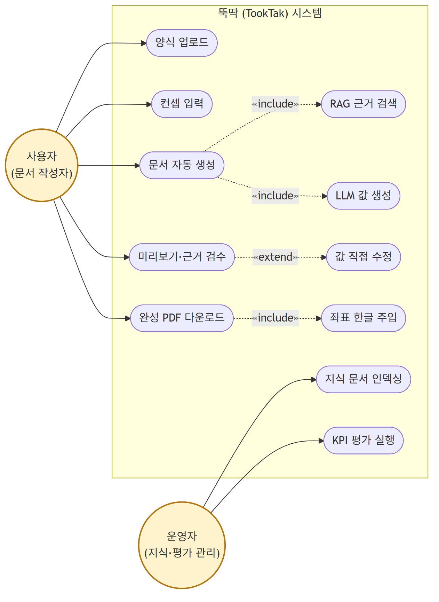

# 요구사항 정의서

과제명: 오픈소스 LLM·RAG 기반 PDF 양식 자동 작성 시스템 (뚝딱, TookTak)
작성일: 2026. 06. 22.

---

## 1. 개요

### □ 문서의 목적

본 문서는 "오픈소스 LLM·RAG 기반 PDF 양식 자동 작성 시스템(뚝딱)" 개발의 요구사항을 정의한 문서이다.
상기 서비스는 빈 PDF 양식과 사용자의 컨셉 입력만으로, 사내 문서를 근거로 한 RAG와 온프레미스 오픈소스 LLM(Qwen3 8B)을 활용해 양식의 각 항목을 자동으로 채운 완성 문서를 생성하는 것을 목표로 한다. 모든 처리는 사내(로컬)에서 수행되어 외부 네트워크 호출이 발생하지 않는다.

이 요구사항 정의서는 PDF 양식 자동 작성 시스템 개발을 위한 설계문서를 작성하는 데 기초가 되며, 사용자 유스케이스를 기반으로 SW가 제공해야 할 기능 및 화면에서 필수적으로 구현되어야 할 요구사항에 대해 기술하고 정의한다.

본 문서는 가능한 구체적이며 간결하게 표현되어야 하고 추후 시험이 가능해야 하며, 본 문서를 사용하는 대상은 본 과제를 기획하는 기획자, SW를 개발하는 개발자 등이며, 본 과제의 요구사항 도출 및 개발 과정에서 본 문서를 활용할 수 있도록 한다.

### □ 요구사항 및 문서의 범위

본 문서에서는 유스케이스 및 기능·비기능 요구사항의 기술을 그 범위로 한다.

---

## 2. 유스케이스

### □ 유스케이스 다이어그램

(상세: [유스케이스 문서](유스케이스.md))

### □ 유스케이스 명세

#### UC-01 양식 업로드

| 항목 | 내용 |
|---|---|
| 유스케이스 이름 | 양식 업로드 |
| 유스케이스 ID | UC-01 |
| 관련 요구사항 | RF-01, RF-02, RF-03 |
| 우선순위 | 필수 |
| 선행조건 | 입력 필드(AcroForm)가 있는 빈 PDF 양식을 보유 |
| 관련 액터 | 사용자 |
| 이벤트 흐름 | 1. 사용자가 빈 PDF 양식을 업로드한다 2. 시스템이 폼필드(이름·라벨·타입·좌표)를 추출한다 3. 추출된 필드 목록을 화면에 표시한다 |
| 종료조건 | 양식의 입력 필드가 추출되어 컨셉 입력 화면으로 전환됨 |

#### UC-02 문서 자동 생성

| 항목 | 내용 |
|---|---|
| 유스케이스 이름 | 문서 자동 생성 |
| 유스케이스 ID | UC-02 |
| 관련 요구사항 | RF-04, RF-05, RF-06, RF-07 |
| 우선순위 | 필수 |
| 선행조건 | 양식 필드가 추출됨, 사내 지식 문서가 인덱싱됨 |
| 관련 액터 | 사용자 |
| 이벤트 흐름 | 1. 사용자가 문서 컨셉을 입력한다 2. 시스템이 RAG로 사내 문서에서 근거를 검색한다 3. LLM이 근거·컨셉 기반으로 필드별 값을 생성한다 4. 각 값의 근거/추론 여부를 판정해 미리보기에 표시한다 |
| 종료조건 | 모든 필드에 값(또는 빈값)이 생성되어 미리보기로 제공됨 |

#### UC-03 미리보기·검수 및 완성 PDF 다운로드

| 항목 | 내용 |
|---|---|
| 유스케이스 이름 | 미리보기·검수 및 완성 PDF 다운로드 |
| 유스케이스 ID | UC-03 |
| 관련 요구사항 | RF-08, RF-09, RF-10, RF-11 |
| 우선순위 | 필수 |
| 선행조건 | 필드 값이 생성됨 |
| 관련 액터 | 사용자 |
| 이벤트 흐름 | 1. 사용자가 근거/추론 구분 표시를 보고 값을 검수한다 2. 필요 시 값을 직접 수정한다 3. 다운로드를 요청한다 4. 시스템이 좌표에 한글로 값을 주입·평탄화한다 5. 완성 PDF를 제공한다 |
| 종료조건 | 채워진 PDF가 다운로드됨 |

#### UC-04 지식 문서 인덱싱

| 항목 | 내용 |
|---|---|
| 유스케이스 이름 | 지식 문서 인덱싱 |
| 유스케이스 ID | UC-04 |
| 관련 요구사항 | RF-12 |
| 우선순위 | 필수 |
| 선행조건 | 사내 지식 문서(파일)를 보유 |
| 관련 액터 | 운영자 |
| 이벤트 흐름 | 1. 운영자가 지식 문서를 등록한다 2. 시스템이 텍스트를 정제·청킹한다 3. 임베딩 후 ChromaDB에 저장한다 |
| 종료조건 | 검색 가능한 벡터 인덱스가 생성됨 |

---

## 3. 기능 요구사항

| ID | 요구사항명칭 | 설명 | 우선순위 |
|---|---|---|:---:|
| RF-01 | 양식 업로드 | AcroForm 입력 필드가 있는 빈 PDF 양식을 업로드한다 | 필수 |
| RF-02 | 폼필드 자동 추출 | 필드명·라벨·타입·좌표·필수여부·최대길이를 추출한다 | 필수 |
| RF-03 | 라벨 자동 추론 | 위젯 주변 텍스트로 사람이 읽는 라벨을 추론한다 | 필수 |
| RF-04 | 컨셉 입력 | 작성할 문서의 컨셉·지시를 자연어로 입력한다 | 필수 |
| RF-05 | RAG 근거 검색 | 사내 지식 문서에서 top-k 근거 청크를 검색한다 | 필수 |
| RF-06 | 필드값 자동 생성 | 근거·컨셉 기반으로 각 필드 값을 생성한다(계산 포함) | 필수 |
| RF-07 | 근거/추론 판정 | 생성 값이 근거에 존재하는지 판정·표시한다 | 필수 |
| RF-08 | 미리보기·값 수정 | 근거/추론 구분으로 표시하고 값을 직접 수정한다 | 필수 |
| RF-09 | 좌표 한글 주입 | 추출 좌표에 한글 폰트로 값을 주입·평탄화한다 | 필수 |
| RF-10 | 멀티라인 문단 채움 | 서술형 박스는 줄바꿈·폰트 자동축소로 채운다 | 필수 |
| RF-11 | 완성 PDF 다운로드 | 채워진 PDF를 내려받는다 | 필수 |
| RF-12 | 지식 문서 인덱싱 | 사내 문서를 정제·청킹·임베딩해 저장한다 | 필수 |
| RF-13 | KPI 측정 | 정확도·시간단축·근거율·외부호출을 측정한다 | 권장 |
| RF-14 | 평면 PDF 주입 | 입력 필드 없는 PDF에 좌표 오버레이로 주입한다 | 선택 |
| RF-15 | 하이브리드 검색·리랭킹 | BM25+벡터(RRF)+리랭킹으로 정확도를 높인다 | 선택 |

---

## 4. 비기능 요구사항

| ID | 요구사항명칭 | 설명 | 적용시점 |
|---|---|---|---|
| RN-01 | 외부 호출 0건 | 외부 도메인 호출 0건(완전 로컬). 소켓 실측으로 확인 | 운영·측정 |
| RN-02 | 민감정보 비저장 | 인덱싱/학습 데이터에 민감정보 미포함 | 개발·운영 |
| RN-03 | 채움 정확도 | 폼필드 채움 정확도 ≥ 80% | 측정 |
| RN-04 | 근거 일치율 | 채운 값 기준 근거 일치율 ≥ 90% | 측정 |
| RN-05 | 시간 단축 | 수작업 대비 작성 시간 ≥ 50% 단축 | 측정 |
| RN-06 | 로컬 추론 자원 | 단일 GPU/CPU·소형 양자화 모델로 동작 | 배포·운영 |
| RN-07 | 사용성 | 업로드→컨셉→미리보기·다운로드 3단계 UI | 개발 |
| RN-08 | 한글 렌더링 | 한글 폰트 깨짐 없이 좌표 주입 | 개발 |
| RN-09 | 컨테이너 배포 | docker compose 단일 명령 기동 | 배포 |
| RN-10 | 모듈 분리·유지보수성 | 스키마 계약 기반 단방향(DAG) 의존 | 개발 |
| RN-11 | 자동 테스트 | 핵심 로직 오프라인 테스트 통과 | 개발 |

---

## 제약 사항

| ID | 제약 |
|---|---|
| C-01 | 외부 상용 API(ChatGPT 등) 미사용 — 사내 데이터 외부 전송 금지 |
| C-02 | 상업 배포 시 Apache-2.0 모델(Qwen3)만 사용 |
| C-03 | MVP 지원 양식은 AcroForm 기반 (평면 PDF는 중장기) |
| C-04 | 데이터·모델 라이선스·출처 명시 및 재배포 조건 준수 |
