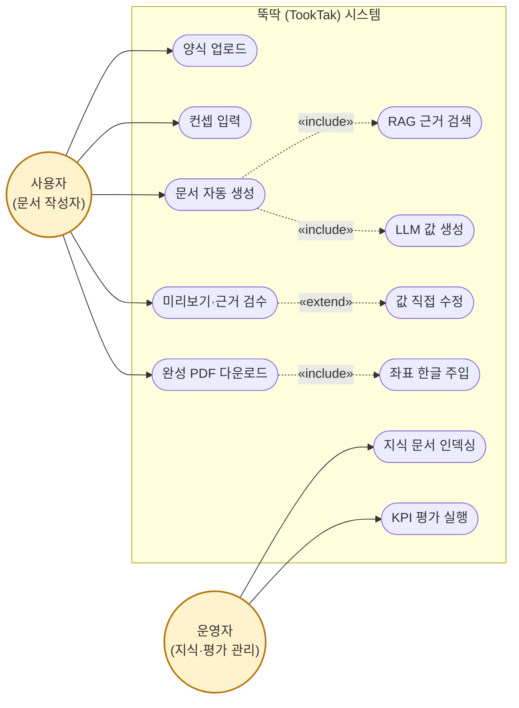

# 뚝딱(TookTak) 유스케이스 다이어그램

> 액터(원형) · 시스템 경계 · 유스케이스(스타디움) · «include»/«extend» 관계.
> **PNG**: [유스케이스 다이어그램](diagrams/04_usecase.png) (소스: `diagrams/04_usecase.mmd`)

## 액터

| 액터 | 설명 |
|---|---|
| 사용자 (문서 작성자) | 빈 양식을 올리고 컨셉을 입력해 완성 문서를 받는 주 사용자 |
| 운영자 (지식·평가 관리) | 사내 지식 문서를 인덱싱하고 KPI를 측정·관리 |

## 유스케이스 명세

| ID | 유스케이스 | 액터 | 설명 | 관련 모듈 |
|---|---|---|---|---|
| UC1 | 양식 업로드 | 사용자 | 빈 PDF 양식 업로드 → 필드·좌표 자동 추출 | parsing |
| UC2 | 컨셉 입력 | 사용자 | 작성할 문서의 컨셉·지시 입력 | api |
| UC3 | 문서 자동 생성 | 사용자 | 근거 기반으로 각 필드 값 생성 | generation |
| UC4 | 미리보기·근거 검수 | 사용자 | 생성 값을 근거/추론 구분으로 확인 | frontend |
| UC5 | 값 직접 수정 | 사용자 | 미리보기에서 값 수동 보정 (UC4의 확장) | frontend |
| UC6 | 완성 PDF 다운로드 | 사용자 | 좌표 주입·평탄화된 완성 PDF 내려받기 | injection |
| UC7 | 지식 문서 인덱싱 | 운영자 | 사내 문서 청킹·임베딩·Qdrant 저장 | rag |
| UC8 | KPI 평가 실행 | 운영자 | 정확도·근거율·외부호출 0 측정 | eval |

## 관계

- **«include»** — `문서 자동 생성`은 `RAG 근거 검색`과 `LLM 값 생성`을 항상 포함한다.
- **«include»** — `완성 PDF 다운로드`는 `좌표 한글 주입`을 항상 포함한다.
- **«extend»** — `미리보기·근거 검수` 중 필요 시 `값 직접 수정`으로 확장된다.
